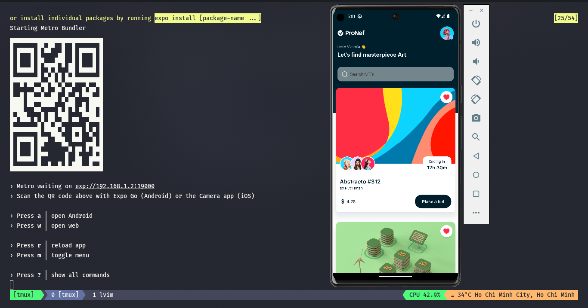

# NFT Marketplace - Modern UI/UX React Native App

## Installation

### Note:

- You must install nodeJS before, copy .env.local to .env
- If you want to run .http file, you have to install `REST Client` extension!

---

1. Install virtual device via [Android Studio](https://developer.android.com/studio). If you want to run this app on real device, install Expo Go on your device and continue on the stage 4.
2. Using [Expo CLI](https://docs.expo.dev/get-started/installation/) - this tools help us code applications out of the box
3. Cloning this projects and install via `npm i` (if use npm) or `yarn` (is use yarn)
4. Starting project: `npm start` and following the menu.
   After that,

Happy coding :)
